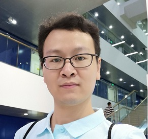

I am currently a senior research and development engineer working in Baidu Intelligent Driving Group (IDG). 
I received my PhD in Computing Science from National University of Defense Technology under the co-supervision of Prof. Sikun Li and Prof. [Baoquan Chen](http://web.siat.ac.cn/~baoquan/). 

My research interests include Computer Vision, Computer Graphics and Robotics, especially in Simultaneous Localization and Mapping (SLAM), Structure from Motion (SFM), 3D Reconstruction, Point Cloud Processing, as well as Mapping and Localization for Autonomous Driving. My research profiles can be found at [Google Scholar](https://scholar.google.com/citations?user=99pnrfMAAAAJ&hl=en).

## Selected Publications

<ul>

  
  <li>
  
  </li>
  

</ul>

<ul>
  
  <li>
    Robust and Precise Vehicle Localization based on Multi-sensor Fusion in Diverse City Scenes,
    Guowei Wan, Xiaolong Yang, Renlan Cai, Hao Li, Yao Zhou, Hao Wang, Shiyu Song,
    In ICRA 2018.
  </li>
</ul>
